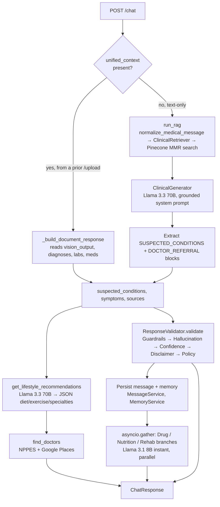
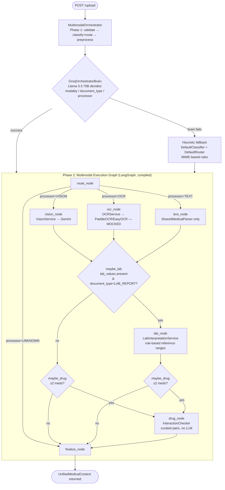
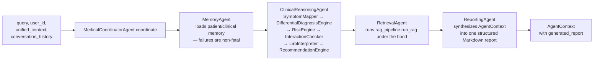
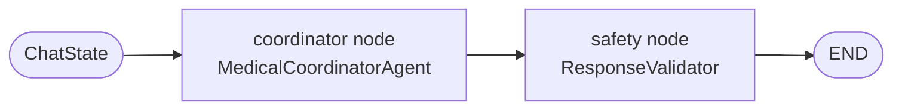
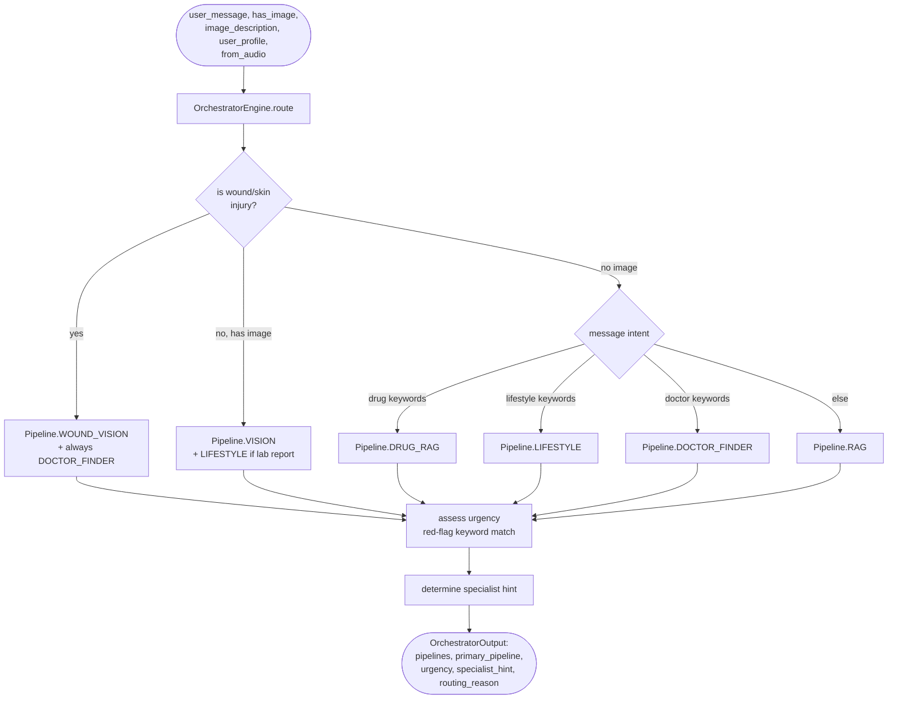
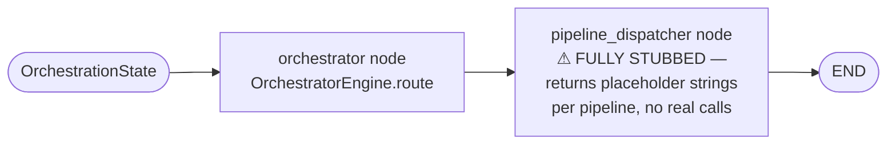
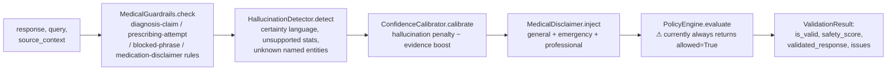
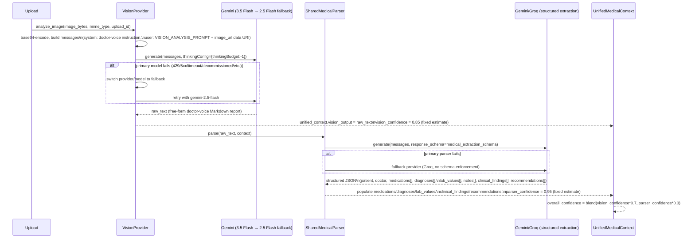

# MedCortex — Project Documentation

> Structure follows the BU Spark! Project Workflow Guide (Project Definition → Research/Architecture Understanding → Implementation), adapted for an in-progress, multi-owner engineering hand-off rather than a first-time project pitch.
> **Owner of this document:** Ali Soliman (frontend, backend infrastructure, orchestration/LangGraph migration, vision pipeline).
> **Sections marked `🔲 TODO — Owner: <name>`** are reserved for teammates and intentionally left as structural placeholders so everyone documents their piece the same way.

---

## Table of Contents

1. [Introduction](#1-introduction)
2. [The Idea](#2-the-idea)
3. [Project Workflow](#3-project-workflow)
4. [System Architecture — Full Diagrams](#4-system-architecture--full-diagrams)
5. [Frontend](#5-frontend)
6. [Backend — Core Infrastructure](#6-backend--core-infrastructure)
7. [Vision Pipeline (Detailed)](#7-vision-pipeline-detailed)
8. [Reserved Sections for Team Members](#8-reserved-sections-for-team-members)
9. [Appendix — Model Registry & Known Architectural Debt](#9-appendix--model-registry--known-architectural-debt)

---

## 1. Introduction

**MedCortex** is a full-stack, AI-powered clinical assistant. It lets a patient talk to the system in plain language, upload a medical document (lab report, prescription, scan), or speak a question out loud — and receive a grounded clinical response that includes:

- A clinical answer, generated either from retrieved medical-textbook knowledge (RAG) or from direct interpretation of an uploaded document (Vision).
- Lifestyle recommendations (diet, exercise, rest) tied to the detected symptoms/conditions.
- Doctor/specialist referrals, including Egypt-specific geographic search.
- Specialist add-ons (drug interactions, nutrition, rehab guidance).
- A safety layer that screens, validates, and disclaims every response before it reaches the user.

The project started as a team effort — one contributor (frontend + backend infrastructure) and teammates building the retrieval/RAG notebooks — and has since grown into a production-oriented system with its own multimodal ingestion pipeline, clinical-reasoning subsystem, and safety subsystem.

**Stack at a glance:**

| Layer | Technology |
|---|---|
| Frontend | Next.js 14 (App Router), TypeScript, Tailwind CSS |
| Backend | FastAPI, SQLAlchemy (SQLite → Postgres planned) |
| Orchestration | LangChain LCEL → migrating to LangGraph |
| Vector store | Pinecone serverless (AWS us-east-1) |
| Primary LLM | Llama 3.3 70B via Groq |
| Vision LLM | Gemini 3.5 Flash (fallback Gemini 2.5 Flash / Pro) |
| Embeddings | BAAI/bge-large-en-v1.5 |
| Auth | JWT + Google OAuth |

This document is the **entry point** for anyone joining the project. It explains *why* MedCortex exists, *how* the system is put together end-to-end, and gives a diagrammed map of every pipeline currently in the repository — including which ones are live in production versus scaffolded/orphaned. Sections on the frontend, core backend infrastructure, and the vision pipeline are fully detailed here. Sections covering the remaining model subsystems (RAG/retrieval, clinical intelligence, drug/nutrition/rehab branches, doctor recommendation, OCR, the LangGraph orchestrator migration) are intentionally left as **structured placeholders** in Section 8 for the rest of the team to fill in, using the same format.

---

## 2. The Idea

### 2.1 Problem statement

A patient with a symptom, a lab report, or a prescription in hand typically has three options: wait for a doctor's appointment, search unreliable sources online, or guess. None of these give a fast, grounded, and safety-checked first read on what's going on.

### 2.2 What MedCortex does instead

MedCortex acts as a **first-pass clinical knowledge layer**:

1. It answers medical questions **only from grounded sources** (curated medical textbooks + NIH-derived knowledge in Pinecone) — it explicitly refuses to answer when the retrieved context doesn't contain the answer, rather than hallucinating.
2. It can **read an uploaded document** (a lab report, a prescription, an X-ray) directly via a vision-language model and turn it into a structured, doctor-voice explanation.
3. It **never stops at just an answer** — every clinically relevant response is paired with lifestyle guidance and a doctor referral (with real geographic doctor search for Egypt), because information without a next step isn't useful in a medical context.
4. It treats **safety as a first-class subsystem**, not an afterthought — disclaimers, hallucination detection, unsafe-request screening, and guardrails all sit between the model and the user.

### 2.3 "How would a human do this without AI?"

A human triage nurse or pharmacist would: listen to the symptom description, cross-reference it against known conditions and red-flag criteria, check the patient's current medications for interactions, recommend an immediate lifestyle adjustment, and refer them to the right specialist if needed — while never overstepping into a diagnosis. MedCortex mirrors this division of labor across dedicated subsystems (clinical reasoning, drug interaction checking, lifestyle advice, doctor referral, safety validation) instead of asking one model to do everything in one shot.

### 2.4 Path to operationalization

- **Interface:** Next.js web app (chat-first UX, document upload, voice input).
- **Serving:** FastAPI backend, containerizable, currently backed by SQLite with a documented path to Postgres for structured data (physician directory).
- **Models:** hosted inference only (Groq, Gemini) — no self-hosted model serving, which keeps the operational footprint small and lets the team focus on orchestration and grounding quality rather than infra.
- **Current inflection point:** the system is migrating from an **imperative, sequential pipeline** (routes call clinical/retrieval functions directly, one after another) to a **LangGraph-based multi-node graph with an LLM orchestrator** as the routing layer, because the number of pipelines has outgrown what a hand-written sequence of `if/else` calls can maintain cleanly.

---

## 3. Project Workflow

Following the phased structure of a data-science project (definition → research → data/EDA → PoC → deployment → evaluation), here is where MedCortex sits today, phase by phase:

| Phase | Status | Notes |
|---|---|---|
| **1. Definition & use case** | ✅ Done | Clinical assistant for patients; NIH MedlinePlus + curated textbooks as the knowledge base; Egypt-specific doctor referral as a concrete end-user feature. |
| **2. Research & problem understanding** | ✅ Done | Data pipeline (MedlinePlus alphabet sweep + Docling-parsed textbooks) established; RAG vs. fine-tuning decision made in favor of RAG + curated sources. |
| **3. Data preparation / EDA** | ✅ Done | 4,822 MedlinePlus chunks + 9,513 textbook vectors in Pinecone (`medical-assistant` index, `medical_textbooks_base` namespace), 1024-dim BGE embeddings, cosine similarity. |
| **4. Proof-of-concept model** | ✅ Done | Working chat pipeline (RAG + Llama 3.3 70B) and vision pipeline (Gemini) both functional end-to-end. |
| **5. Deployed PoC as a service** | 🟡 In progress | FastAPI backend + Next.js frontend both running; a **full backend audit** was completed before starting the next architectural step (see Section 9), revealing several stub/disconnected components. |
| **6. Evaluation & iteration** | 🟡 Ongoing | Currently mid-refactor: migrating the imperative pipeline to a LangGraph orchestrator, wiring disconnected clinical utilities, replacing mocked OCR, and activating the safety/policy layer end-to-end. |

**Current sprint focus (per the completed audit):**

- Migrate `/chat` from direct function calls to a LangGraph graph with an LLM orchestrator node (`llama-3.3-70b-versatile`) making the routing decision.
- Wire the currently-disconnected clinical utilities (medication normalizer, entity resolver, evidence ranker, guideline lookup, timeline builder) into the live pipeline.
- Replace mocked OCR providers (PaddleOCR/EasyOCR) with real extraction.
- Activate the safety/policy layer so `unsafe_request_handler` actually runs **before** pipeline execution, and `policy_engine` does real evaluation instead of always returning "allowed."
- Add the drug-RAG, doctor-recommendation-RAG, and wound-vision pipelines that are currently only stubbed as `Pipeline` enum members.

---

## 4. System Architecture — Full Diagrams

This section gives the complete, end-to-end map of the application — every pipeline, live or scaffolded. Each diagram is labeled with its **current status** so nobody mistakes an orphaned graph for a live one.

### 4.1 High-level system map

```mermaid
flowchart TB
    subgraph Client["Frontend — Next.js 14"]
        UI[Chat Workspace / Auth / Upload UI]
    end

    subgraph API["FastAPI Backend"]
        AUTH[/auth/]
        CHAT[/chat/ — LIVE]
        UPLOAD[/upload/ — LIVE]
        TRANSCRIBE[/transcribe/ — LIVE]
        DOCS[/egyptian-doctors, /egyptian-hospitals/ — LIVE]
        BRANCHES[/drugs, /nutrition, /rehab/ — LIVE standalone]
    end

    subgraph AI["AI Subsystems"]
        RAG[RAG Pipeline\nrag_pipeline.py]
        SAFETY[Safety Layer\nResponseValidator]
        CLINICAL_FN[Lifestyle + Doctor Finder\nfunctions called directly]
        MULTIMODAL[Multimodal Orchestrator\n+ LangGraph]
        AGENTS[Agent Layer\nMedicalCoordinatorAgent — ORPHANED]
        ORCH[Orchestrator Engine\n+ LangGraph — ORPHANED]
    end

    subgraph External["External Services"]
        GROQ[(Groq\nLlama 3.3 70B / 3.1 8B / Whisper)]
        GEMINI[(Gemini\n3.5 Flash / 2.5 Flash-Pro)]
        PINECONE[(Pinecone\nmedical-assistant index)]
        NPPES[(NPPES NPI Registry)]
        GPLACES[(Google Places)]
        OSM[(OpenStreetMap Overpass — preferred, no key)]
    end

    UI --> AUTH
    UI --> CHAT
    UI --> UPLOAD
    UI --> TRANSCRIBE
    UI --> DOCS
    UI --> BRANCHES

    CHAT --> RAG --> PINECONE
    RAG --> GROQ
    CHAT --> CLINICAL_FN --> GROQ
    CHAT --> DOCS
    CHAT --> SAFETY --> GROQ
    UPLOAD --> MULTIMODAL --> GEMINI
    MULTIMODAL -.mocked.-> OCRNOTE[OCR: PaddleOCR/EasyOCR — MOCKED]
    DOCS --> NPPES
    DOCS --> GPLACES
    DOCS -. preferred fallback .-> OSM
    BRANCHES --> GROQ

    AGENTS -. not invoked by any route .- RAG
    ORCH -. not invoked by any route .- CLINICAL_FN
```

**Reading this diagram:** the boxes with `— LIVE` are wired into an actual FastAPI route today. `AGENTS` (the `MedicalCoordinatorAgent` pipeline) and `ORCH` (the rule-based `OrchestratorEngine` + its LangGraph) are fully implemented and independently testable, but **no HTTP route currently calls into them** — they exist as parallel, more structured designs that the LangGraph migration is expected to fold in as the single source of truth.

---

### 4.2 `/chat` pipeline (live, current imperative implementation)



**Status:** LIVE — this is the exact code path in `app/api/chat.py` today. Note that when `unified_context` is present (i.e., the user is discussing an uploaded document), **Pinecone/RAG is bypassed entirely** — this is documented architecture debt, not a bug.

---

### 4.3 `/upload` pipeline — Multimodal LangGraph (live)

This is the **one LangGraph that is actually compiled and invoked in production** today.



**Status:** LIVE — compiled via `get_multimodal_graph()` (`app/ai/graph/multimodal_builder.py`) and invoked directly in `app/api/upload.py`.

---

### 4.4 Agent Layer — `MedicalCoordinatorAgent` (implemented, currently orphaned)



There is also a two-node LangGraph wrapper around this exact pipeline (`app/ai/graph/builder.py` → `build_medical_graph()`): `coordinator` node runs the above, `safety` node runs `ResponseValidator`. **Neither the agent pipeline nor this graph is called by any FastAPI route today** — `/chat` still calls the clinical/retrieval functions directly rather than through this coordinator. This is the design the LangGraph migration is expected to promote to be the real routing layer.



---

### 4.5 Rule-Based Orchestrator Engine + its LangGraph (implemented, currently orphaned)



Its LangGraph wrapper (`app/ai/graph/orchestration_builder.py`):



**Status:** ORPHANED, and its dispatcher node is a stub even in isolation — it doesn't call the real RAG/vision/drug/lifestyle functions yet, just returns placeholder text. This is one of the pieces the LangGraph migration needs to either complete or replace.

---

### 4.6 Safety Validation Pipeline (live, invoked from `/chat` and the orphaned `safety_node`)



**Status:** LIVE for the guardrails/hallucination/confidence/disclaimer stages. `PolicyEngine` is a stub that always allows, and `UnsafeRequestHandler` (pattern-based pre-screening for self-harm, prescribing attempts, definitive-diagnosis requests) exists and is fully implemented but **is never called before the pipeline runs** — both are flagged for the current sprint.

---

## 5. Frontend

**Stack:** Next.js 14 (App Router), TypeScript, Tailwind CSS, JWT + Google One Tap OAuth.

### 5.1 Structure

```
frontend/
├── app/
│   ├── login/, signup/          → AuthWaveLayout wrapper + LoginForm/SignupForm
│   ├── chat/                    → ChatWorkspace (main app screen)
│   ├── api/doctors/places/      → Next.js API route proxying Google Places nearby search
│   └── api/transcribe/          → Next.js API route proxying backend /transcribe
├── components/
│   ├── auth/                    → AuthWaveLayout, FloatingField, GoogleSignInButton
│   ├── chat/                    → ChatWorkspace, ResponseCard, VoiceButton, UploadButton
│   └── ui/                      → shared primitives
├── hooks/                       → useSpeechToText, useDoctorRecommendations
├── services/chat.ts              → API client for /chat
└── types/chat.ts                 → shared TypeScript types
```

### 5.2 Design system

- Purple/violet theme (`--primary: #d9c5ff`, `--primary-strong: #ae84ff`), soft surfaces, rounded (24px) cards — defined in `globals.css` as CSS variables + Tailwind `@theme inline` mapping.
- **Auth pages** use `AuthWaveLayout`: animated SVG wave/blob background, glassmorphism card, floating-label pill inputs, gradient CTA buttons (`from-[#8566FF] to-[#6f4ef2]`).
- Fully responsive (single column mobile → dual column desktop), dark-mode-aware tokens already defined in `globals.css` (currently mirrored to the same light palette; not yet diverged).

### 5.3 Key interaction flows

- **Chat:** `ChatWorkspace` posts to `/chat`, renders `ResponseCard` with tabs for diagnosis / lifestyle / doctors / sources, supports markdown + tables.
- **Voice input:** `useSpeechToText` hook records audio → posts to the Next.js `/api/transcribe` route → proxies to backend `/transcribe` (Groq Whisper `whisper-large-v3-turbo`).
- **Document upload:** `UploadButton` posts the file to backend `/upload`; the returned `unified_context` is attached to the next `/chat` call so the document's findings ground the conversation.
- **Doctor recommendations:** `useDoctorRecommendations` hook can call either the backend's Egypt-aware search or the Next.js `/api/doctors/places` route (direct Google Places nearby search) depending on the flow.

### 5.4 In-progress frontend work

- Auth page redesign: **complete** (dark-themed split layout, deep purple `#0e0a1f` background, Playfair Display serif headings, Outfit sans-serif body).
- Lab report UI redesign: **in progress** — full visual overhaul while preserving all existing content exactly; not yet finalized.

---

## 6. Backend — Core Infrastructure

**Stack:** FastAPI, SQLAlchemy ORM, SQLite (dev) with Postgres planned for the physician directory, JWT auth with Google OAuth verification.

### 6.1 Structure (infrastructure layer only — AI subsystems detailed in later sections)

```
backend/app/
├── main.py                 → FastAPI app, router registration, CORS, startup checks
├── api/                    → auth, chat, conversations, messages, history, upload,
│                             transcribe, egyptian_doctors, egyptian_hospitals,
│                             drugs, nutrition, rehab
├── database/database.py    → SQLAlchemy engine/session (SQLite by default)
├── models/                 → User, Conversation, Message, ConversationSummary,
│                             MedicalReport, Favorite, Feedback, AITask,
│                             UserPreference, MemoryEntry, PatientProfile
├── repositories/           → data-access layer used by services (not shown in full here)
├── services/               → ConversationService, MessageService, MemoryService,
│                             HistoryService, TaskService, AuthService, PromptService
├── schemas/                → Pydantic request/response models
├── middleware/logging_middleware.py
├── utils/security.py       → JWT issue/verify, password hashing, Google ID token verification
├── utils/observability.py  → StructuredLogger, MetricsCollector, timed_operation, trace_agent
└── config/settings.py      → single source of truth for all configuration
```

### 6.2 Authentication

- `POST /auth/signup`, `/auth/login` — email/password with bcrypt hashing (`passlib`) and JWT (`python-jose`, HS256, 60 min expiry by default).
- `POST /auth/google` — verifies a Google ID token (`google-auth`), checks issuer allow-list and email verification, creates the user on first login with a random placeholder password.
- `GET /auth/me` — returns current user from `Authorization: Bearer` token.
- `/chat` supports **optional** authentication (`get_current_user_optional`) — anonymous chat works, but conversation persistence, memory, and history require a logged-in user.

### 6.3 Conversation & message persistence

- `Conversation` (soft-deletable via `status`), `Message` (stores provider/model/execution_time/token_usage/citations/attachments/workflow/metadata as JSON), `ConversationSummary` (auto-generated when message count crosses `MEMORY_CONVERSATION_LIMIT`), `MemoryEntry` (typed longitudinal facts: condition, allergy, medication, preference, extracted per-conversation), `UserPreference` (language, response style, preferred provider/model).
- `MemoryService.inject_memory()` assembles user preferences + persistent memory + conversation summary + recent messages into the exact structured shape `PromptBuilder.build_chat_prompt()` expects, in a fixed order (system → preferences → persistent memory → summary → retrieved context → formatting instructions, with recent messages and the current question appended around it).
- `HistoryService` supports full-text-ish search (`LIKE`) across conversation titles/message content, favoriting messages, and per-message feedback (1–5 rating + comment).

### 6.4 Configuration (`app/config/settings.py`)

Single `Settings` object (pydantic-settings, `.env`-driven) covering: API keys (Groq/Gemini/Pinecone/Google Places), model names per task (`MODEL_CHAT`, `MODEL_VISION`, `MODEL_VISION_FALLBACK`, `MODEL_DOCUMENT`, `MODEL_REWRITE`, `MODEL_OCR`, `MODEL_EMBEDDING`), provider-per-task mapping, Pinecone index/namespace, timeouts and token budgets per subsystem, OCR retry policy, upload constraints, safety toggles (`SAFETY_ENABLED`, `SAFETY_BLOCK_UNSAFE_REQUESTS`, etc.), feature flags per pipeline, and observability/logging config. Production mode enforces that `GROQ_API_KEY`, `PINECONE_API_KEY`, and `DATABASE_URL` are actually set (validator raises otherwise).

### 6.5 Provider abstraction layer

- `BaseAIProvider` / `BaseChatProvider` / `BaseEmbeddingProvider` define the contract; `GroqProvider` and `GeminiProvider` implement it.
- `ProviderFactory` + module-level `get_provider()` / `get_default_llm()` / `get_default_embeddings()` give every subsystem a single, cached way to obtain a model client without hardcoding SDK calls — this is what lets the vision pipeline and the chat pipeline swap models purely through `settings.py` without touching call sites.
- `ModelRegistry` (`app/ai/providers/model_registry.py`) is a discoverable catalogue of every registered model (name, provider, type, context length, description) — used for introspection/tooling, not for routing decisions itself.

### 6.6 Observability

`app/utils/observability.py` provides a JSON-structured logger (`StructuredLogger`), an in-memory `MetricsCollector` (counters + histograms, meant to be swapped for Prometheus/Datadog in production), a `timed_operation` context manager, and a `trace_agent` decorator that auto-instruments any `BaseAgent.run()` implementation with call/success/failure counters and duration histograms.

---

## 7. Vision Pipeline (Detailed)

This is the fully-owned, fully-documented subsystem for this hand-off. It is the path taken by every uploaded image or PDF that the multimodal orchestrator routes to `ProcessorType.VISION` (which, by design, is almost everything — see §7.5).

### 7.1 Models used

| Role | Model | Provider | Notes |
|---|---|---|---|
| Primary vision-language model | **Gemini 3.5 Flash** (`gemini-3.5-flash`) | Google Gemini | `settings.MODEL_VISION`. Ingests images **and PDFs natively** — no separate OCR step needed for the primary path. |
| Fallback vision-language model | **Gemini 2.5 Flash** (`gemini-2.5-flash`) | Google Gemini | `settings.MODEL_VISION_FALLBACK`. Triggered automatically on 429/5xx, rate limit, quota, timeout, "overloaded", or model-decommissioned errors from the primary. |
| Document/structured-extraction model | **Gemini 2.5 Flash** (`settings.MODEL_DOCUMENT`), fallback **Groq Llama 3.3 70B** | Gemini → Groq | Used by `SharedMedicalParser` to turn the vision model's free-text clinical narrative into structured JSON (patient, medications, diagnoses, lab values, notes, clinical findings, recommendations). |
| Registry-listed alternative | `gemini-2.5-pro` | Gemini | Registered in `ModelRegistry` as a general-purpose Gemini vision option; not currently wired as the active default or fallback. |
| Groq vision fallback (registered, not wired) | `llama-4-scout` | Groq | Present in `ModelRegistry`/`ModelRouter` as a theoretical Groq-side vision fallback; the actual `VisionProvider` fallback chain only uses Gemini↔Gemini today. |

### 7.2 Why Vision-first, not OCR-first

`DefaultRouter` deliberately routes **both images and PDFs to Vision**, not OCR:

> "PDFs to the Vision model (Gemini). Gemini ingests PDFs natively and produces a far richer clinical interpretation (lab-value comparison, drug extraction, doctor-grade summary) than raw OCR text extraction. OCR remains available as an internal fallback inside the vision service if needed." — `app/ai/multimodal/router.py`

The `GroqOrchestratorBrain` (the LLM that makes the classify+route decision in Phase 1 of `/upload`) is given the same guidance directly in its system prompt: route to VISION for "images (skin, wounds, x-ray, MRI, CT, ultrasound, eye) and PDFs/documents (lab reports, prescriptions, referrals, discharge summaries)", and reserve OCR "only when the file is a scanned document that genuinely needs text extraction."

### 7.3 The two-call vision architecture

Every document that reaches `VisionService.process()` goes through **two separate LLM calls**, not one:



**Critical design guarantee:** if the second call (structured parsing) fails for any reason, **the raw vision output is never lost** — `VisionService.process()` catches the parser exception, logs it, sets `parser_confidence = 0.0`, and still returns the context with the full doctor-voice narrative intact. The frontend/chat layer is written to fall back to showing that raw narrative if structured fields are empty (see `_build_document_response` in `app/api/chat.py`).

### 7.4 The vision prompt design (`app/ai/prompts/vision_prompts.py`)

This is a deliberately engineered prompt, not a generic "describe this image" call:

- **`VISION_SYSTEM_INSTRUCTION`** casts the model as a senior board-certified internist speaking directly to the patient — calm, complete, never a one-line summary, reads *every* value on the document (including normal ones), reports exact figures with units, uses the document's own printed reference range when present (falling back to "typical adult range" only when it isn't), explicitly flags anything unreadable rather than guessing.
- **`VISION_ANALYSIS_PROMPT`** is a 4-step instruction:
  1. Identify the document type (lab report / prescription / both / other) and extract patient/date/clinic/doctor metadata.
  2. If lab results are present: emit a Markdown table (Test | Result | Unit | Normal Range | Status | What this means) for **every single value**, then a "Reassuring findings" and "Findings worth discussing with your doctor" section.
  3. If a prescription is present: for every drug, emit dose/route/frequency/duration/likely indication/warnings, followed by a "how to take your medicines safely" summary.
  4. Close with a 2–4 sentence "Doctor's overall impression" plus a one-line educational disclaimer.
- The prompt explicitly tells the model to **use its full token budget** rather than stopping early — this is why `AI_MAX_TOKENS_VISION` is set generously (16,384) in settings, since Gemini's "thinking" models share that budget between internal reasoning and the visible answer.
- A legacy `MEDICAL_PARSER_PROMPT` constant is kept only for backward compatibility with older callers and is explicitly documented as **never allowed to overwrite** the rich narrative output.

### 7.5 Resilience characteristics

| Concern | Mechanism |
|---|---|
| Oversized images | `DefaultPreprocessor` (`app/ai/multimodal/preprocessing.py`) downsizes any image over 30M pixels or 6000px on the long edge before it reaches the vision model, preserving format (JPEG/PNG/WEBP) and handling RGBA→RGB flattening for JPEG output. |
| Transient provider failure | `tenacity`-based retry: 3 attempts, exponential backoff (2–10s) around every `generate()` call. |
| Hard timeout | `min(AI_TIMEOUT_VISION, AI_MAX_TIMEOUT_VISION)` — configurable soft timeout capped by an absolute ceiling (default 45s soft / 90s hard). |
| Model-level failure (429/5xx/quota/decommissioned/etc.) | Automatic, one-time provider/model swap to the fallback (`gemini-2.5-flash`), then retried with the same retry policy. |
| Structured-parse failure | Non-fatal — raw vision narrative is preserved; `parser_confidence` set to 0 and a warning logged instead of raising. |
| Confidence reporting | Fixed heuristic estimates today (`vision_confidence = 0.85`, `parser_confidence = 0.95` on success) rather than a model-reported score — flagged here for anyone later wiring in real confidence signals. |

### 7.6 Known gaps in this subsystem (for the LangGraph migration)

- Vision confidence values are hardcoded constants, not derived from the model call itself.
- The Groq fallback (`llama-4-scout`) is registered in the model catalogue but not actually implemented as a vision-provider fallback path — only Gemini↔Gemini fallback exists in code.
- Wound-specific vision (the planned `wound_vision` pipeline referenced in `app/ai/orchestrator/pipelines.py`) is not yet a distinct code path — wound images currently still flow through the same generic `VisionProvider`/`VISION_ANALYSIS_PROMPT`, which is written for lab reports and prescriptions, not dermatological assessment. This is one of the "new files needed" call-outs for the orchestrator migration (a dedicated `wound_vision_node`).

---

## 8. Reserved Sections for Team Members

Each of the following is a placeholder. **Please keep the same sub-heading structure** (Purpose → Models Used → Data Flow / Diagram → Current Status → Known Issues / Next Steps) so the final document reads consistently no matter who wrote which section.

### 8.1 Retrieval / RAG Pipeline
**Owner:** 🔲 _TODO — assign_

- Purpose:
- Models Used:
- Data Flow / Diagram:
- Current Status:
- Known Issues / Next Steps:

> Relevant files to document from: `app/ai/retrieval/rag_pipeline.py`, `retrievers.py`, `generators.py`, and the stub abstractions in `embedder.py`, `query_rewriter.py`, `reranker.py`, `hybrid_search.py`, `context_formatter.py`, `retriever.py` (these last several are defined but never called by the live pipeline — worth explicitly documenting as scaffolding vs. live code).

### 8.2 Clinical Intelligence Subsystem
**Owner:** 🔲 _TODO — assign_

- Purpose:
- Models Used (note: most of this subsystem is deterministic/rule-based, not LLM-driven):
- Data Flow / Diagram:
- Current Status:
- Known Issues / Next Steps:

> Relevant files: `diagnosis.py` (SymptomMapper, DifferentialDiagnosisEngine), `risk_engine.py`, `interaction_checker.py`, `contraindication_checker.py`, `lab_interpreter.py`, `recommendation_engine.py`, `medical_entity_resolver.py`, `medication_normalizer.py`, `clinical_guideline_lookup.py`, `evidence_ranker.py`, `timeline_builder.py`, `medical_reasoner.py` (the coordinating `ClinicalReasoningEngine`), and `agents/clinical_agent.py`.

### 8.3 Drug / Nutrition / Rehab Specialist Branches
**Owner:** 🔲 _TODO — assign_

- Purpose:
- Models Used:
- Data Flow / Diagram:
- Current Status:
- Known Issues / Next Steps:

> Relevant files: `branches/drug_branch.py`, `branches/nutrition_branch.py`, `branches/rehab_branch.py`, and their standalone endpoints `api/drugs.py`, `api/nutrition.py`, `api/rehab.py`. All three currently run on `llama-3.1-8b-instant` specifically to preserve the 70B daily token budget for the primary pipeline — worth explaining the rate-limit reasoning here.

### 8.4 Doctor / Physician Recommendation Systems
**Owner:** 🔲 _TODO — assign_

- Purpose:
- Models Used:
- Data Flow / Diagram (note there are **two parallel systems** — reconcile or document both):
- Current Status:
- Known Issues / Next Steps:

> Relevant files: `clinical/doctor_finder.py` (NPPES + Google Places, used by the live `/chat` pipeline) vs. `branches/doctor_branch.py` (Pinecone `clinics_doctors_egypt` namespace + GeoJSON governorate/locality boundary matching + Bayesian rating score, used by the standalone `/egyptian-doctors` endpoint). **Important architectural note already established:** physician/structured data must never be mixed into the main Pinecone knowledge namespaces — it belongs in its own namespace or, per the long-term plan, a separate SQL/Postgres table with an `is_local` flag.

### 8.5 OCR Subsystem
**Owner:** 🔲 _TODO — assign_

- Purpose:
- Models/Engines Used:
- Data Flow / Diagram:
- Current Status: **Both `PaddleOCRProvider` and `EasyOCRProvider` currently return hardcoded mocked output** — this needs to be called out explicitly and replaced with real inference.
- Known Issues / Next Steps:

### 8.6 LangGraph Orchestrator Migration (the central refactor)
**Owner:** 🔲 _TODO — assign (likely Ali + whoever proposed the LangGraph architecture)_

- Purpose: replace the imperative `/chat` routing in Section 4.2 with a graph where an LLM orchestrator node (`llama-3.3-70b-versatile`) decides which of the pipelines documented in 8.1–8.5 (plus vision, Section 7) to invoke, replacing the currently-orphaned `OrchestratorEngine`/`pipeline_dispatcher_node` (Section 4.5) and `MedicalCoordinatorAgent` (Section 4.4) with one unified, LangGraph-native design.
- New nodes needed (per current planning): orchestration node, drug-RAG node, wound-vision node, doctor-finder node, lifestyle node, plus wiring for the disconnected clinical utilities.
- Data Flow / Diagram: _to be drawn once the target graph shape is finalized — Sections 4.4 and 4.5 above are the two existing candidate designs to reconcile._
- Current Status:
- Known Issues / Next Steps:

### 8.7 Multilingual University Regulations RAG (separate sub-project, shared Pinecone instance)
**Owner:** 🔲 _TODO — assign_

- Purpose:
- Models Used (multilingual-e5-large embeddings, Llama 3.3 70B via Groq at temperature=0):
- Data Flow / Diagram:
- Current Status: Colab notebook pipeline in progress (`university_regulations` namespace, similarity-threshold gate, article-citation enforcement).
- Known Issues / Next Steps:

---

## 9. Appendix — Model Registry & Known Architectural Debt

### 9.1 Full model list (from `ModelRegistry` + `Settings`)

| Task | Model | Provider |
|---|---|---|
| Chat / RAG generation | `llama-3.3-70b-versatile` | Groq |
| Upload orchestration brain | `llama-3.3-70b-versatile` | Groq |
| Reasoning (registered, not actively routed) | `qwen-3.6-27b` | Groq |
| Vision (primary) | `gemini-3.5-flash` | Gemini |
| Vision (fallback) | `gemini-2.5-flash` | Gemini |
| Vision (registered alt.) | `gemini-2.5-pro` | Gemini |
| Vision (registered, unused Groq fallback) | `llama-4-scout` | Groq |
| Document/structured parsing | `gemini-2.5-flash` → `llama-3.3-70b-versatile` fallback | Gemini → Groq |
| Query rewrite (registered, not actively routed) | `llama-3.1-8b` | Groq |
| Drug / Nutrition / Rehab branches | `llama-3.1-8b-instant` | Groq |
| Location extraction (Egyptian doctor search) | `llama-3.1-8b-instant` | Groq |
| Conversation summarization / fact extraction | `llama-3.1-8b-instant` | Groq |
| Speech-to-text | `whisper-large-v3-turbo` | Groq |
| Embeddings (medical textbooks) | `BAAI/bge-large-en-v1.5` | HuggingFace (local) |
| Embeddings (university regulations, separate project) | `intfloat/multilingual-e5-large` | HuggingFace (local) |
| OCR (registered, currently mocked) | `paddleocr` | local / HuggingFace |

### 9.2 Consolidated known architectural debt

(carried forward from the completed backend audit — useful for whoever picks up each section in Part 8)

- Multiple retrieval abstractions (embedder, query rewriter, reranker, hybrid search, context formatter, generic retriever) are fully-typed stubs never called by the live RAG pipeline.
- OCR providers return mocked text, not real extraction.
- `PolicyEngine` always returns `allowed=True`; `UnsafeRequestHandler` is fully implemented but never invoked before pipeline execution.
- Several clinical utilities are implemented but disconnected from any live pipeline (see 8.2) — the audit's core finding was that this can happen **silently, with no runtime error**, which is why explicit wiring verification is required before/after the LangGraph migration.
- `graph/builder.py` (agent-layer graph) and `graph/orchestration_builder.py` (rule-based orchestrator graph) are both compiled and independently testable but not invoked by any API route.
- RAG/Pinecone is bypassed entirely whenever a document `unified_context` is present in `/chat`.
- Doctor referral reliance on LLM prompt sensitivity alone is unreliable for emotionally-phrased (vs. clinically-phrased) symptom messages — three fixes are proposed (stronger system prompt, hard trigger keywords, backend-side message injection) but not yet implemented.
